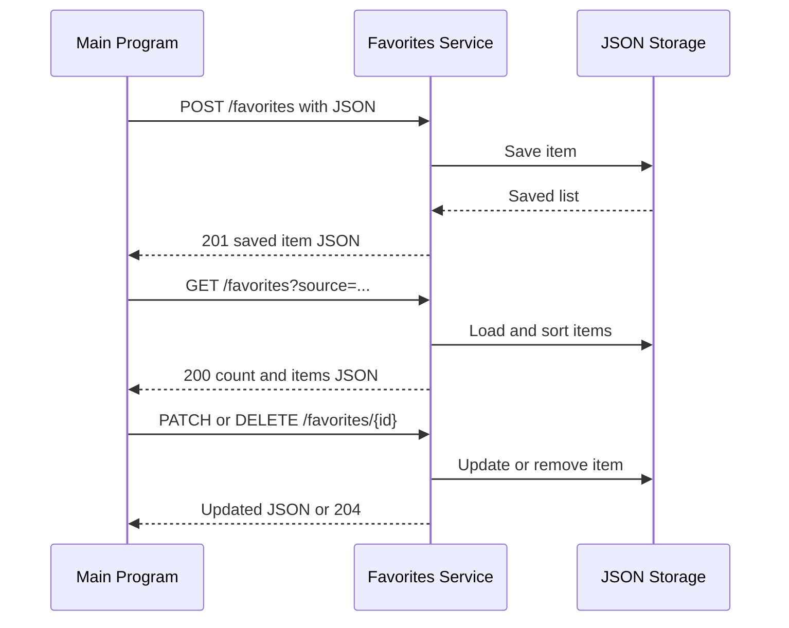

# Favorites and Saved Items Service

MS3 is a reusable service for saving and pinning items from different Main
Programs.

## Communication contract

The service uses a REST API with JSON at `http://127.0.0.1:5103` by default.

| Method and path | Purpose |
| --- | --- |
| `GET /health` | Check whether the service is running |
| `POST /favorites` | Save an item from a Main Program |
| `GET /favorites?source={program}` | List one Main Program's saved items with pinned items first |
| `PATCH /favorites/{id}/pin` | Pin an item, or send `{"pinned": false}` to unpin it |
| `PATCH /favorites/{id}` | Edit `name`, `description`, `category`, or `url` on a saved item |
| `DELETE /favorites/{id}` | Remove a saved item |

New items require `source_id` and `name`. `source`, `description`, `category`,
`url`, and a JSON `metadata` object are optional. Duplicate `source` and
`source_id` pairs return HTTP 409.

`GET /favorites` is paginated: `page` defaults to 1 and `page_size` defaults to 20. The
response includes `total` (items matching the filter across all pages) alongside `count`
(items in this page) so a Main Program can page through the full list.

Each caller should send its own stable `source` name, such as `StudyPlanner`,
`HabitTracker`, or `PrepTrack`. This keeps identifiers and saved lists separate
when more than one Main Program uses the same service instance.

Browser-based callers can set `MAIN_PROGRAM_ORIGINS` to a comma-separated list
of allowed origins. The older single-value `MAIN_PROGRAM_ORIGIN` setting still
works.

### How to request data

```powershell
python -m pip install -r requirements.txt
python app.py
```

In another terminal:

```powershell
Invoke-RestMethod -Method Post -Uri http://127.0.0.1:5103/favorites `
  -ContentType application/json `
  -Body '{"source":"StudyPlanner","source_id":"task-1","name":"Review notes"}'
```

### How to receive data

The request returns HTTP 201 with the saved item as JSON. The service creates
the `id`, `pinned`, and `saved_at` fields.

```json
{
  "id": "service-created-id",
  "source": "StudyPlanner",
  "source_id": "task-1",
  "name": "Review notes",
  "description": "",
  "category": "",
  "url": "",
  "pinned": false,
  "saved_at": "2026-08-08T22:00:00+00:00"
}
```

List requests return `count`, `total`, `page`, `page_size`, and `items` as JSON.
Validation, duplicate, pagination, and missing-item errors return a JSON `error`
object with `code` and `message`.

## Request sequence



Run the automated tests with `python -m pytest -q`.

## Sprint 3 stories

- Save an item as a favorite.
- Pin an urgent or important item at the top of the saved-items list.

## Remaining shared work

The required save, list, pin, update, delete, pagination, persistence,
validation, shared cross-program contract, 50-item restart check, and 100-item
performance check are implemented. Bulk operations and advanced sorting remain
optional shared follow-up work.
